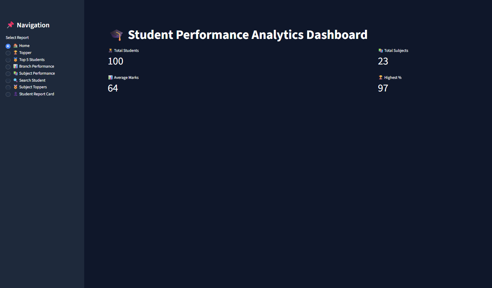
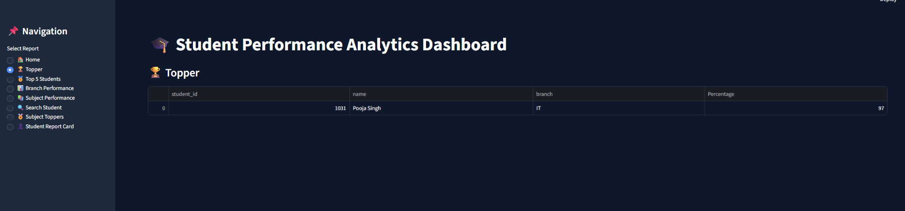

# 🎓 Student Performance Analytics Dashboard

Student Performance Analytics Dashboard is a **data-driven web application** built using **Python, Streamlit, and SQL Server** to analyze and visualize student academic performance through interactive dashboards and reports.

---

## ✨ Features

- 🏠 Home Dashboard  
- 🥇 Topper Analysis  
- 👨‍🎓 Top 5 Students  
- 🏫 Branch Performance  
- 📚 Subject Performance  
- 🏆 Subject Toppers  
- 📄 Student Report Card  
- 🔍 Search Student  

---

## 🛠️ Technologies Used

- Python
- Streamlit
- SQL Server
- Pandas
- PyODBC

---

## 📂 Project Structure

```text
Student/
│── .streamlit/
│   └── config.toml
│
├── screenshots/
│   ├── Home_Dashboard.png
│   ├── Topper.png
│   ├── Top 5 Students.png
│   ├── Branch Performance.png
│   ├── Subject Performance.png
│   ├── Subject Toppers.png
│   ├── Search Student.png
│   └── Database Schema.png
│
├── app.py
├── requirements.txt
└── README.md
```

---

## 🚀 Run Project

### Install Dependencies

```bash
pip install -r requirements.txt
```

### Start Streamlit App

```bash
streamlit run app.py
```

---

# 📸 Dashboard Screenshots

## 🏠 Home Dashboard

---

## 🥇 Topper Analysis


---


## 📈 Dashboard Capabilities

- Analyze student performance
- Compare branch-level outcomes
- Identify subject toppers
- Search individual student reports
- Visualize academic trends

---

## 🤝 Contributing

Contributions are welcome.

Fork the repository and submit improvements.

---

## 📄 License

This project is intended for educational purposes.
