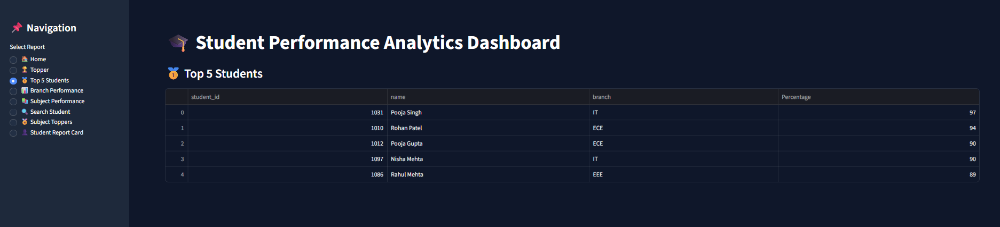
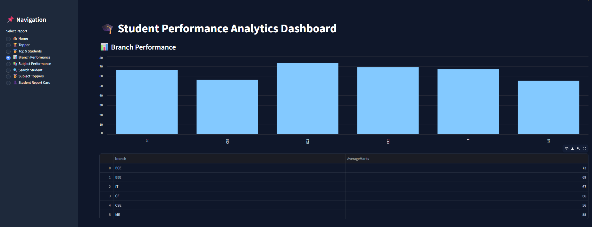
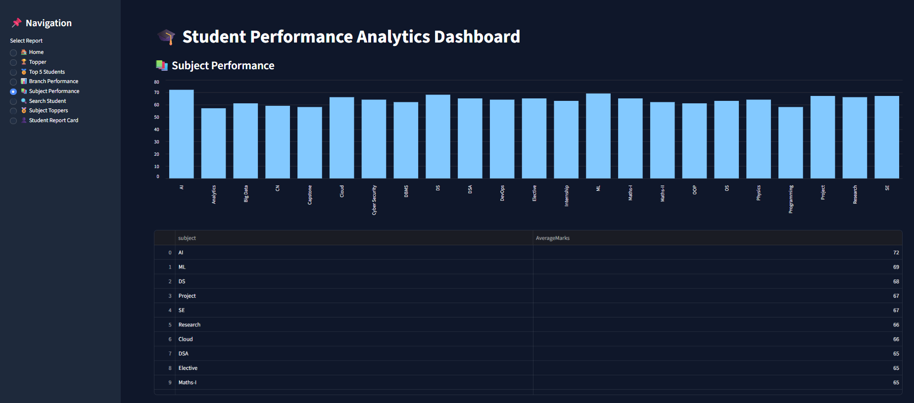
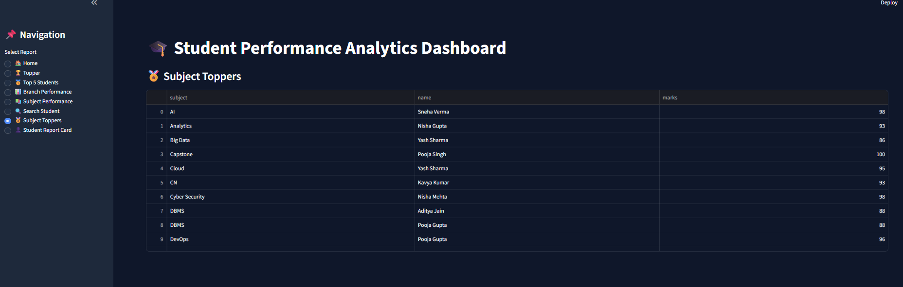
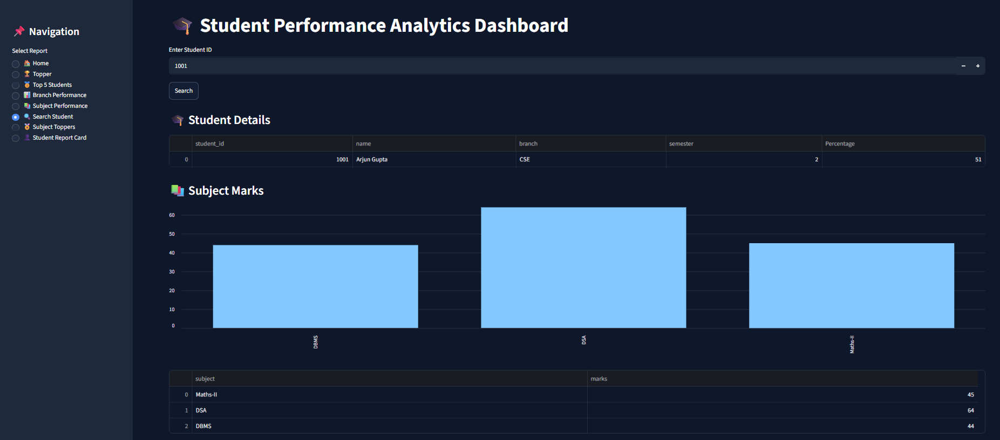
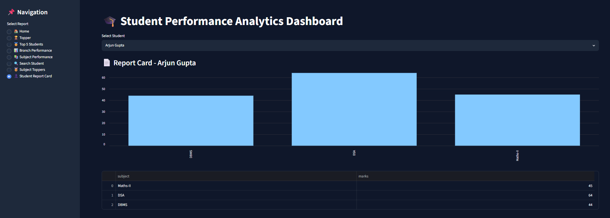
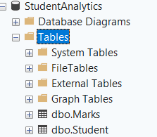

# 🎓 Student Performance Analytics Dashboard

A modern **Student Performance Analytics Dashboard** developed using **Python, Streamlit, and SQL Server** to analyze, monitor, and visualize student academic performance through interactive dashboards and reports.

This project helps educational institutions and students gain meaningful insights into academic trends, topper analysis, branch performance, and subject-wise results.

---

## ✨ Features

* 🏠 **Home Dashboard** – Overview of student performance metrics
* 🥇 **Topper Analysis** – Identify highest-performing students
* 👨‍🎓 **Top 5 Students** – Display top-ranking students
* 🏫 **Branch Performance** – Compare performance across branches
* 📚 **Subject Performance** – Subject-wise academic analysis
* 🏆 **Subject Toppers** – Highlight top scorers in each subject
* 📄 **Student Report Card** – Individual student performance report
* 🔍 **Search Student** – Search and view student details instantly

---

## 🛠️ Technologies Used

| Technology | Purpose               |
| ---------- | --------------------- |
| Python     | Backend Development   |
| Streamlit  | Dashboard UI          |
| SQL Server | Database Management   |
| Pandas     | Data Processing       |
| PyODBC     | Database Connectivity |

---

## 📂 Project Structure

```text
Student/
│
├── .streamlit/
│   └── config.toml
│
├── screenshots/
│   ├── home_dashboard.png
│   ├── topper.png
│   ├── top_5_students.png
│   ├── branch_performance.png
│   ├── subject_performance.png
│   ├── subject_toppers.png
│   ├── search_student.png
│   ├── student_report_card.png
│   └── database_schema.png
│
├── app.py
├── requirements.txt
└── README.md
```

---

## 🚀 Installation & Execution

### 1️⃣ Clone the Repository

```bash
git clone <https://github.com/Sakshi-180620/student-performance-analytics-dashboard.git>
cd Student
```

### 2️⃣ Install Required Packages

```bash
pip install -r requirements.txt
```

### 3️⃣ Run the Application

```bash
streamlit run app.py
```

The dashboard will open automatically in your browser.

---

# 📸 Dashboard Screenshots

## 🏠 Home Dashboard


---

## 🥇 Topper Analysis


---

## 👨‍🎓 Top 5 Students



---

## 🏫 Branch Performance



---

## 📚 Subject Performance



---

## 🏆 Subject Toppers



---

## 🔍 Search Student



---

## 📄 Student Report Card



---

## 🗄️ Database Schema



---

## 📊 Dashboard Outcomes

This dashboard enables users to:

* Track academic performance efficiently
* Compare branch and subject statistics
* Identify top-performing students
* Generate student-level reports
* Support educational data-driven decisions

---

## 🎯 Future Enhancements

* Export reports as PDF
* Add login authentication
* Integrate machine learning prediction models
* Deploy using Streamlit Cloud

---

## 👨‍💻 Author

**Sakshi Patidar**
B.Tech – 5th Semester
Department of Computer Science & Engineering

GitHub: `Sakshi-180620`

---

## 📄 License

This project is developed for **academic and educational purposes**.
